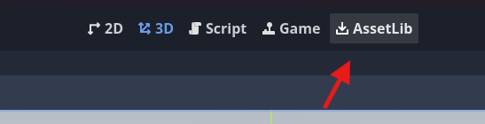
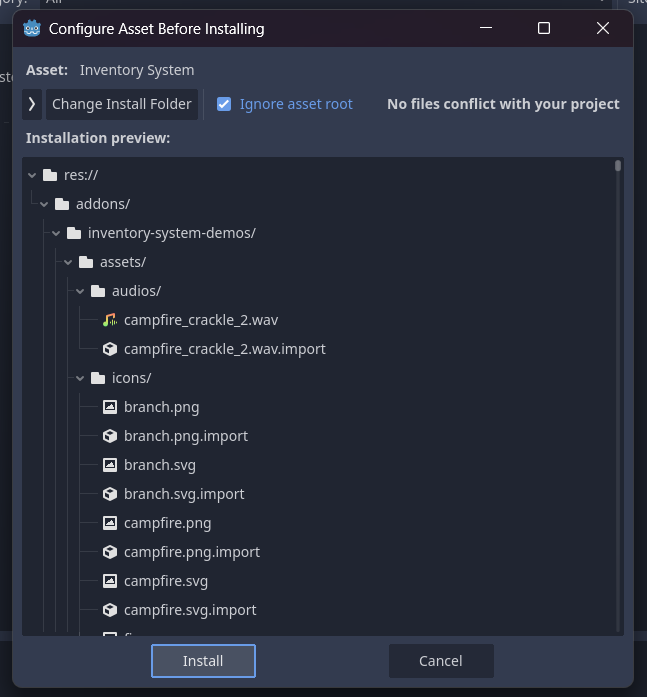
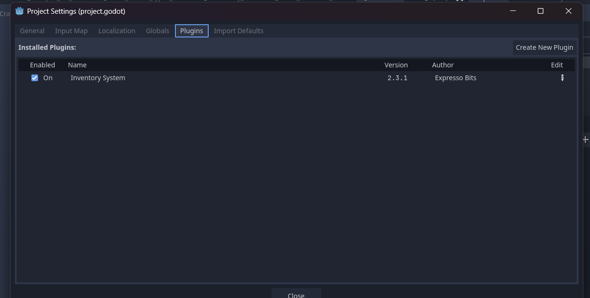

.. _installation:

######################
Installation and Setup
######################

Installing
==========

There are two ways to install the plugin, via godot asset lib and via submodule

A. Installing via Godot Asset Lib
----------------------------------------

Enter in Asset Lib on top view of Godot:

Search for the "Inventory System" plugin

.. image:: ./images/select_plugin_in_assetlib.png

Select Download

.. image:: ./images/download_plugin.png

Select Install for add addon in your project.

B. Install via Git Modules
----------------------------------------

Open a terminal in your project folder and type command for add submodule

.. code:: pwsh
    
    git submodule add https://github.com/expressobits/inventory-system.git addons/inventory-system

Type command for start submodule

.. code:: pwsh

    git submodule update --init --recursive

Active Plugin after install
==============================

After installing, you may need to restart godot and then activate it in ProjectSettings

