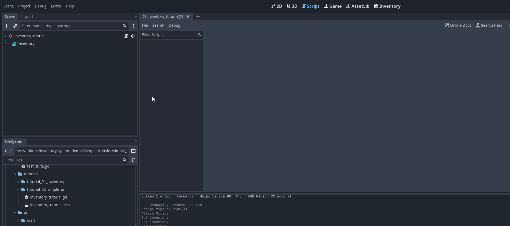

##########################
Add Simple UI
##########################

This guide shows how to connect a UI to your inventory already created in the last guide. 
The idea of this plugin is for the developer to create their own UIs, as each game will have its own UI nuances, 
but UI scripts placed in the addons/inventory-system-demos/simple_transfer folder can be used as bases.

==============================
Adding a UI
==============================

Add a SimpleInventoryUI node to the previously created scene, switch to 2D view and place this node to fill the entire screen:

.. _simple_inventory_ui.gd: https://github.com/expressobits/inventory-system/blob/7335c341afc0b2f5ea81bd7e7a84e59285a24a0f/addons/inventory-system-demos/simple-transfer/simple_inventory_ui.gd
.. warning::
    This script is only in the plugin demos, it is only downloaded from the addon branch or via godot asset lib, it is not included via git modules.
    See code here: `simple_inventory_ui.gd`_

Now let's define the connection between the inventory and the UI. To do this, select the newly created Simple Inventory UI node and in the inspector, place the reference to the Inventory node:

.. image:: ./images/simple_inventory_ui_inspector.png
    :width: 50%

.. image:: ./images/simple_inventory_ui_inspector_filled.png
    :width: 50%

Done, now when you press play and use the :guilabel:`&F1` keys to add items, you will be able to see your items being displayed with their information such as name and icon:

.. image:: ./images/run_simple_ui.gif

.. note::
    Play around here, go to the inventory editor and change the stack that can be stored to check that this number implies how many items are in each stack of this inventory.

==============================================
Understanding the script simple_inventory_ui.gd
==============================================

Let's understand a little bit of the code previously added to our scene. 
In ready, a _queue_refresh is triggered that will call the function below that adds an item through the add_item function in the node itself that extends godot's ItemList:

.. code-block:: gdscript

    func _populate_list() -> void:
	if !is_instance_valid(inventory):
		return

	for i in inventory.stacks.size():
		var item = inventory.stacks[i]
		var definition : ItemDefinition = inventory.database.get_item(item.item_id)
		var texture := definition.icon
		add_item(_get_item_title(item, definition), texture)
		set_item_metadata(get_item_count() - 1, i)

Here we can see that when an inventory is defined (and also at initialization) it connects the inventory change signals to call the _queue_refresh() and _update_stack() methods.
_queue_refresh() will update how many items there are and whether to remove or add new ones, while _update_stack() will update the contents of each item in the inventory. 

.. code-block:: gdscript

    var inventory: Inventory = null:
        set(new_inventory):
            if new_inventory == inventory:
                return
        
            _disconnect_inventory_signals()
            inventory = new_inventory
            _connect_inventory_signals()

            _queue_refresh()

    func _connect_inventory_signals() -> void:
        if !is_instance_valid(inventory):
            return
        if !inventory.contents_changed.is_connected(_queue_refresh):
            inventory.contents_changed.connect(_queue_refresh)
        if !inventory.updated_stack.is_connected(_on_stack_updated):
            inventory.updated_stack.connect(_on_stack_updated)

.. note::
    Understanding how the signals in a :ref:`class_inventory` are used is essential to make important and functional connections for your game, 
    such as updating the UI, making an automatic craft happen or needing to update the client-server in the case of a multiplayer game.