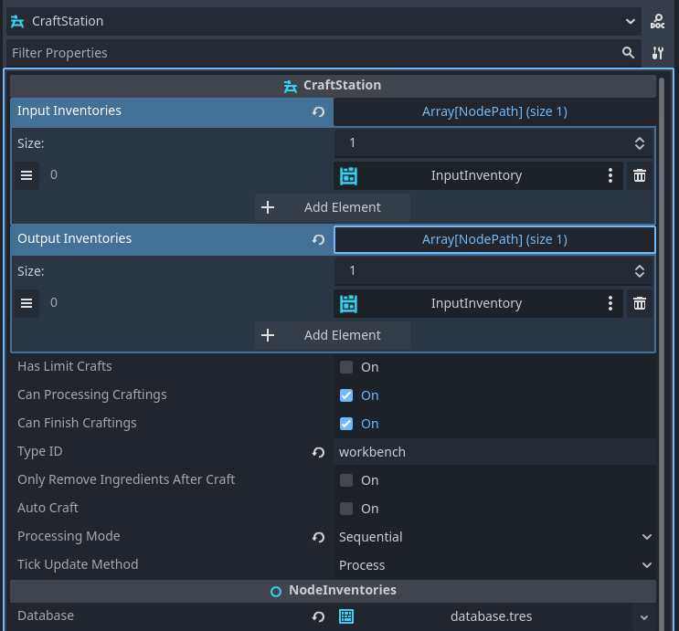

.. _craft_stations:

######################
Craft Stations
######################

Craft Stations are nodes that manage the crafting process in your inventory system. They connect input inventories containing ingredients to output inventories where crafted products are placed, and they process :ref:`Recipe<class_Recipe>` resources to transform items over time.

Overview
========

A :ref:`CraftStation<class_CraftStation>` node provides a complete crafting system that:

- Filters available recipes based on station type
- Validates ingredient availability before starting crafts
- Manages multiple concurrent crafting processes
- Handles timing and progression of crafts
- Automatically moves ingredients and products between inventories
- Provides signals for UI and game logic integration

Key Components
==============

Station Type
------------

Each craft station can have a :ref:`CraftStationType<class_CraftStationType>` that determines which recipes it can process. This allows you to create specialized crafting stations like furnaces, workbenches, or alchemy tables.

Input Inventories
-----------------

Input inventories provide the ingredients and required items for crafting. These are :ref:`Inventory<class_Inventory>` nodes that the craft station monitors for available materials.

Output Inventories
------------------

Output inventories receive the products when crafting completes. Products are automatically added to these inventories when a craft finishes successfully.

.. note::

   Output inventories and Input inventories can be the same inventory.

Valid Recipes
-------------

The station automatically builds a list of recipes it can process based on:

- Recipes in the connected :ref:`InventoryDatabase<class_InventoryDatabase>`
- Station type compatibility
- Current ingredient availability

Setting Up a Craft Station
===========================

Basic Setup
-----------

1. **Add CraftStation Node**
   
   Add a :ref:`CraftStation<class_CraftStation>` node to your scene.

2. **Connect Database**
   
   Set the :ref:`database<class_NodeInventories_property_database>` property to your :ref:`InventoryDatabase<class_InventoryDatabase>` resource.

3. **Add Inventories**
   
   Create :ref:`Inventory<class_Inventory>` nodes for inputs and outputs, then connect them to the craft station.

4. **Configure Station Type (Optional)**
   
   Set the :ref:`type<class_CraftStation_property_type>` property to a specific :ref:`CraftStationType<class_CraftStationType>` if you want to limit which recipes this station can process.

.. code-block:: gdscript

   # Example: Basic craft station setup in code
   @onready var craft_station = $CraftStation
   @onready var input_inventory = $InputInventory
   @onready var output_inventory = $OutputInventory
   
   func _ready():
       # Connect inventories
       craft_station.add_input_inventory(input_inventory)
       craft_station.output_inventories = [output_inventory.get_path()]
       
       # Set station type (optional)
       var furnace_type = database.get_craft_station_type_by_id("furnace")
       craft_station.type = furnace_type

Advanced Configuration
----------------------

**Processing Mode**

Configure how multiple crafts are handled:

- **Sequential**: Crafts process one at a time
- **Parallel**: Multiple crafts process simultaneously

.. code-block:: gdscript

   # Set processing mode
   craft_station.processing_mode = CraftStation.ProcessingMode.PARALLEL

**Craft Limits**

Limit the number of concurrent crafts:

.. code-block:: gdscript

   # Enable craft limits
   craft_station.has_limit_crafts = true
   craft_station.limit_number_crafts = 3

**Auto Crafting**

Enable automatic crafting when ingredients are available:

.. code-block:: gdscript

   # Enable auto-crafting
   craft_station.auto_craft = true

.. note::

   This is used on campfire in fps demo.

Crafting Process
================

Starting a Craft
-----------------

Crafting is initiated by calling the :ref:`craft()<class_CraftStation_method_craft>` method with a recipe index:

.. code-block:: gdscript

   # Start crafting the first available recipe
   if craft_station.valid_recipes.size() > 0:
       craft_station.craft(0)

The system will:

1. Validate the recipe is available and ingredients are present
2. Remove ingredients from input inventories (unless :ref:`only_remove_ingredients_after_craft<class_CraftStation_property_only_remove_ingredients_after_craft>` is enabled)
3. Add a new :ref:`Crafting<class_Crafting>` process to the station's list
4. Begin timing the craft duration

Craft Processing
----------------

Active crafts are processed based on the :ref:`tick_update_method<class_CraftStation_property_tick_update_method>`:

- **Process**: Uses Godot's ``_process()`` callback
- **Physics Process**: Uses Godot's ``_physics_process()`` callback  
- **Custom**: Manual timing via code

.. code-block:: gdscript

   # Example: Custom timing
   craft_station.tick_update_method = CraftStation.TickUpdateMethod.CUSTOM
   
   func _process(delta):
       craft_station.tick(delta)

.. note::

   Custom timing is important for multiplayer server games with ticks.

Finishing Crafts
----------------

When a craft completes:

1. Products are added to output inventories
2. Ingredients are removed (if :ref:`only_remove_ingredients_after_craft<class_CraftStation_property_only_remove_ingredients_after_craft>` is enabled)
3. The :ref:`on_crafted<class_CraftStation_signal_on_crafted>` signal is emitted
4. The craft is removed from the active list

Monitoring Crafting
====================

Signals
-------

CraftStation provides several signals for monitoring the crafting process:

.. code-block:: gdscript

   func _ready():
       # Connect to crafting signals
       craft_station.on_request_craft.connect(_on_craft_requested)
       craft_station.crafting_added.connect(_on_crafting_added)
       craft_station.on_crafted.connect(_on_craft_completed)
       craft_station.crafting_removed.connect(_on_crafting_removed)
   
   func _on_craft_requested(recipe_index: int):
       print("Craft requested for recipe: ", recipe_index)
   
   func _on_crafting_added(crafting_index: int):
       print("Crafting started: ", crafting_index)
   
   func _on_craft_completed(recipe_index: int):
       print("Craft completed for recipe: ", recipe_index)
   
   func _on_crafting_removed(crafting_index: int):
       print("Crafting removed: ", crafting_index)

Current Crafts
--------------

Monitor active crafting processes:

.. code-block:: gdscript

   # Check if station is crafting
   if craft_station.is_crafting():
       print("Station is currently crafting")
   
   # Get current crafting processes
   for i in craft_station.craftings.size():
       var crafting = craft_station.craftings[i]
       var progress = crafting.get_time() / recipe.time_to_craft
       print("Craft ", i, " progress: ", progress * 100, "%")

Recipe Availability
-------------------

Check which recipes are available:

.. code-block:: gdscript

   # Get available recipes
   for recipe_index in craft_station.valid_recipes:
       var recipe = database.recipes[recipe_index]
       var can_craft = craft_station.can_craft(recipe)
       print("Recipe: ", recipe.name, " - Can craft: ", can_craft)

Common Patterns
===============

Furnace Example
---------------

A furnace that smelts ore into metal:

.. code-block:: gdscript

   @onready var craft_station = $CraftStation
   @onready var fuel_inventory = $FuelInventory
   @onready var ore_inventory = $OreInventory
   @onready var output_inventory = $OutputInventory
   
   var is_burning = false
   
   func _ready():
       # Setup inventories
       craft_station.add_input_inventory(fuel_inventory)
       craft_station.add_input_inventory(ore_inventory)
       craft_station.output_inventories = [output_inventory.get_path()]
       
       # Set furnace type
       var furnace_type = database.get_craft_station_type_by_id("furnace")
       craft_station.type = furnace_type
       
       # Monitor fuel changes
       fuel_inventory.item_changed.connect(_update_burning_state)
   
   func _update_burning_state():
       # Check if we have fuel
       is_burning = fuel_inventory.has_item("coal") or fuel_inventory.has_item("wood")
       
       # Enable/disable crafting based on fuel
       craft_station.can_processing_craftings = is_burning
       craft_station.auto_craft = is_burning

Workbench Example
-----------------

A workbench for general item crafting:

.. code-block:: gdscript

   @onready var craft_station = $CraftStation
   @onready var materials_inventory = $MaterialsInventory
   @onready var tools_inventory = $ToolsInventory
   @onready var output_inventory = $OutputInventory
   
   func _ready():
       # Setup inventories
       craft_station.add_input_inventory(materials_inventory)
       craft_station.add_input_inventory(tools_inventory)
       craft_station.output_inventories = [output_inventory.get_path()]
       
       # Set workbench type
       var workbench_type = database.get_craft_station_type_by_id("workbench")
       craft_station.type = workbench_type
       
       # Enable parallel processing for multiple crafts
       craft_station.processing_mode = CraftStation.ProcessingMode.PARALLEL
       craft_station.has_limit_crafts = true
       craft_station.limit_number_crafts = 4

Best Practices
==============

Performance
-----------

- Use appropriate :ref:`tick_update_method<class_CraftStation_property_tick_update_method>` for your needs
- Limit concurrent crafts for complex recipes
- Consider using Custom tick method for precise timing control

User Experience
---------------

- Provide clear visual feedback for crafting progress
- Use signals to update UI elements
- Consider auto-crafting for convenience features

Game Balance
------------

- Set appropriate craft times for pacing
- Balance ingredient requirements with output value
- Use station types to create progression systems

.. seealso::
   
   - :ref:`recipes` - Learn about creating recipes
   - :ref:`craft_station_type` - Learn about station types
   - :ref:`craft_station_ui_tutorial` - Complete CraftStation setup and UI tutorial
