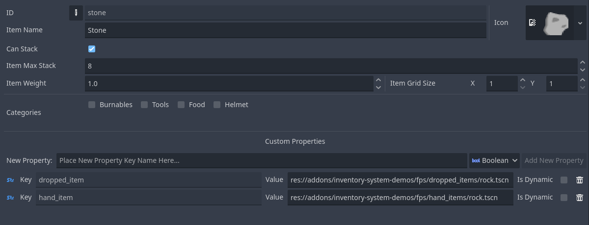

######################
Item Definition
######################

The item definition is a resource that has values 
for items that will be used in the :ref:`class_inventory` node. In it we store various information such as its name, its id, its weight, etc...

==============================
Item ID
==============================

In inventories and other nodes of this plugin, items will not be used as definitions but rather referenced by their id.
Many times you will want to acquire the item definition by id, for this you can use ready-made calls in the inventory node or database:

.. code-block:: gdscript

    var db: InventoryDatabase
    var def: ItemDefinition = db.get_item("my_item_id") # Get item definition by id

.. note::
    The nodes in this plugin also extend the :ref:`class_nodeinventories` which has a direct call to get_item_from_id as well.

    .. code-block:: gdscript

        # Code in a node that extends NodeInventories (Inventory, CraftStation, etc)
        var def: ItemDefinition = db.get_item_from_id("my_item_id") # Get item definition by id

==============================
Item Definition Editor
==============================

In the window, items are displayed in a list on the left side, or we can also search by name.

- :guilabel:`&ID`: 
        String identification of the item, used to get the item based on a list of items easily using the id.
        You can use the button to edit the id correctly, it will indicate in red if the id already exists.
- :guilabel:`&Icon`: 
        Texture to display your item in-game and in the editor
- :guilabel:`&Name`: 
        Name to be displayed or used as additional identification (It is your responsibility to use this field)
- :guilabel:`&Can Stack`: 
        Defines whether there is a :guilabel:`&Max Stack` for the item containing this item definition, unchecked means only one item is added to the stack.
- :guilabel:`&Max Stack`: 
        Maximum stackable item in an inventory, only used if :guilabel:`&Can Stack` is active.
- :guilabel:`&Weight`: 
        Weight of the item, used to calculate the weight of the inventory.
- :guilabel:`&Grid Size`: 
        Size of the item in Vector2i, used to calculate the size of item in :ref:`class_gridinventory`.	
- :guilabel:`&Categories`:
        Categories this item is in are used for categorized stacks to only accept specific items. See in :ref:`class_inventoryconstraint`.