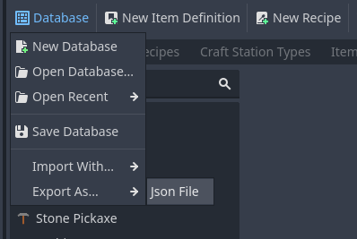
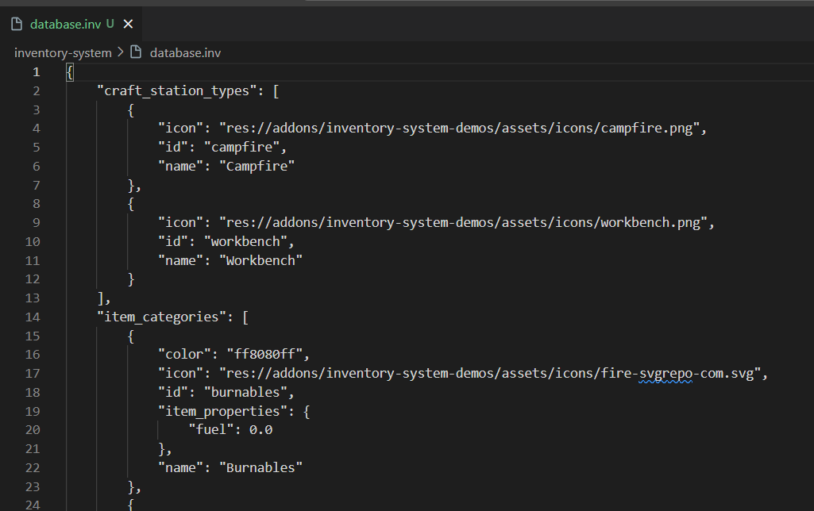

############################################
Work with JSON
############################################

Are you someone who wants full control, without having to touch editors and feel like a hacker modifying texts just to create your project?
So this addon also allows this, with json files that have .inv format it is possible to import and export to the editor easily.
Just like :ref:`Inventory` and :ref:`CraftStation` nodes, databases can be exported from resource to json and imported from json to resource. 
This makes it much easier for you to use a simple text editor to modify how all resources will be defined.

How to export?
-----------------

You can export in the "Inventories" editor (Tab at the top of the editor) by clicking on 
:guilabel:`&Database > Export As > JSON`

Now choose the name and folder where the JSON will be saved.
A file with the :guilabel:`&.inv` extension will be created, here shows an example of the json created with the fps demonstration database.

Importing JSON to Editor
-------------------------

To import it is basically the opposite process, you can access it in menu :guilabel:`&Database > Import With > Json file`

.. image:: images/import_json.png

.. warning:: 
   Please note that the import will cause the data to be completely rewritten from the database editor in the inventory tab.

Import and Export via code
-------------------------

It may be necessary to load your item information or export it at runtime, this is extremely useful for modding, 
generating the need to use this feature via code. For this you can use some codes provided by the :ref:`class_inventorydatabase` class.

.. code-block:: gdscript
    
   var db = InventoryDatabase.new()
   
   # Clear current data
   db.clear_current_data()

   # Load json file to database
   
   db.import_json_file("res://path/to/your/file.inv")
    
   # Save database to json file
   db.export_json_file("res://path/to/your/file.inv")

For modding it may be necessary to just import without having to clean the database first:

.. code-block:: gdscript
    
   @export var db : InventoryDatabase

   # Load Modding json file to database
   db.import_json_file("res://path/to/your/modding.inv")
    

