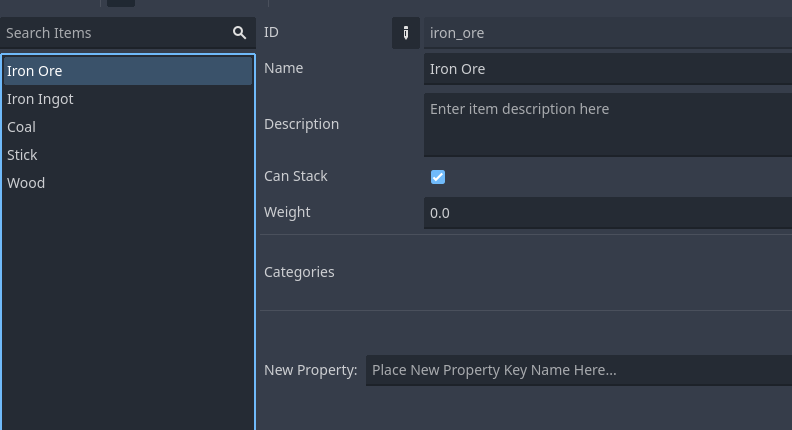
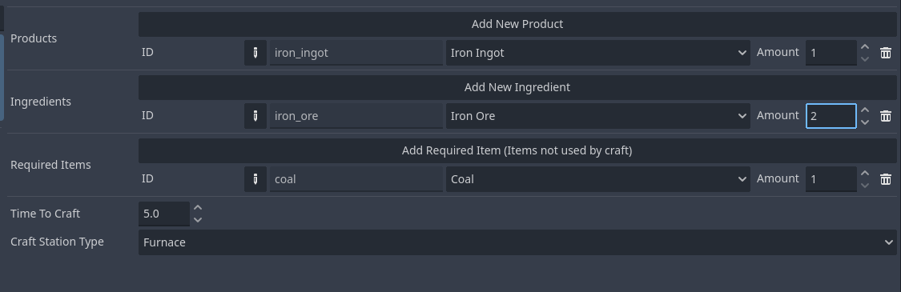

.. _create_and_use_craft_station_type:

###########################################
Create and Use CraftStationType
###########################################

This tutorial will guide you through creating a CraftStationType and using it to organize your recipes by crafting station. We'll create a "Furnace" station type and recipes that can only be crafted at furnaces.

Prerequisites
=============

Before starting this tutorial, make sure you have:

- An inventory system project set up
- An :ref:`InventoryDatabase<class_InventoryDatabase>` resource created
- Basic understanding of the :ref:`create_and_use_recipe` tutorial

Creating the CraftStationType
=============================

Step 1: Open the Database Editor
---------------------------------

1. In your project, open "Inventory" top menus
2. Select "Database" to open the database editor

Step 2: Create the Furnace Station Type
----------------------------------------

1. **Navigate to CraftStationTypes**
   
   In the database editor, click on the "CraftStationTypes" section.

   .. image:: ./../manual/database/images/craft_station_type_editor.png

2. **Add New Station Type**
   
   Click the "+" button to create a new craft station type.

   .. image:: ./../manual/database/images/add_craft_station_type.png

3. **Configure Station Type Properties**
   
   Set the following properties:
   
   - **ID**: Enter "furnace" (this will be used in code)
   - **Name**: Enter "Furnace" (this will be displayed to users)
   - **Icon**: Optionally select a texture that represents a furnace

   .. image:: ./../manual/database/images/craft_station_type_editing.png

4. **Save the Database**
   
   Save your InventoryDatabase resource (Ctrl+S).

Creating Station-Specific Items
===============================

Step 3: Create Smelting Items
------------------------------

For our furnace example, let's create items for smelting:

1. **Iron Ore** (ingredient)
   
   - In the "Item Definitions" section, add a new item
   - Set ID: "iron_ore", Name: "Iron Ore"
   - Set Max Stack Size: 64

2. **Iron Ingot** (product)
   
   - Add another item definition
   - Set ID: "iron_ingot", Name: "Iron Ingot"
   - Set Max Stack Size: 64

3. **Coal** (fuel - required item)
   
   - Add another item definition  
   - Set ID: "coal", Name: "Coal"
   - Set Max Stack Size: 64

4. **Stick** (product)

   - Add another item definition
   - Set ID: "stick", Name: "Stick"
   - Set Max Stack Size: 64

5. **Wood** (crafting ingredient)
   
   - Add another item definition
   - Set ID: "wood", Name: "Wood"
   - Set Max Stack Size: 64

Step 4: Create Furnace-Specific Recipe
---------------------------------------

1. **Add New Recipe**
   
   In the "Recipes" section, click "+" to create a new recipe.

   .. image:: ./../manual/database/images/recipes_editor_add.png

2. **Configure Recipe Properties**
   
   - **Time to Craft**: Set to 5.0 seconds (longer for smelting)

   - **Station**: Select the "Furnace" station type we just created

3. **Add Recipe Components**
   
   **Ingredients** (consumed during crafting):
   - Iron Ore: amount 2
   
   **Required Items** (needed but not consumed):
   - Coal: amount 1
   
   **Products** (created when crafting completes):
   - Iron Ingot: amount 1

4. **Save the Database**

Creating a General Recipe
=========================

Step 5: Create a Universal Recipe
----------------------------------

To demonstrate the filtering, let's also create a recipe that works on any station:

1. **Add Another Recipe**
   
   Create a new recipe for crafting sticks from wood.

2. **Configure Universal Recipe**
   
   - **Time to Craft**: 1.0 seconds
   - **Station**: Leave this EMPTY (no station type)
   - **Ingredients**: Wood: amount 1
   - **Products**: Stick: amount 2

.. image:: ./images/create_and_use_craft_station_types_recipe_stick.png

.. note::
   When a recipe has no station type, it can only be crafted at stations that also have no station type assigned.

Setting Up Test Scenes
=======================

Step 6: Create a Furnace Scene
-------------------------------

1. **Create New Scene**
   
   Create a new scene with Node as root (name: "FurnaceTest").

2. **Add Scene Nodes**
   
   - :ref:`CraftStation<class_CraftStation>` (name: "FurnaceStation")
   - :ref:`Inventory<class_Inventory>` (name: "InputInventory")
   - :ref:`Inventory<class_Inventory>` (name: "OutputInventory")

3. **Configure Inventories**
   
   Set both inventories:

   - **Database**: Your InventoryDatabase

4. **Configure Furnace Station**
   
   Set the CraftStation properties:

   - **Database**: Your InventoryDatabase

   - **Type**: Select the "Furnace" CraftStationType

   - **Input Inventories**: Add InputInventory path

   - **Output Inventories**: Add OutputInventory path

   - **Can Processing Craftings**: Enabled

   - **Can Finish Craftings**: Enabled

   .. image:: ./images/create_and_use_craft_station_types_setup_craft_station.png

Step 7: Create a General Workbench Scene
-----------------------------------------

1. **Create Another Scene**
   
   Create a new scene (name: "WorkbenchTest").

2. **Add Same Nodes**
   
   Add the same node structure as the furnace scene.

3. **Configure Workbench Station**
   
   Set the CraftStation properties the same as furnace, but:
   - **Type**: Leave this EMPTY (no station type)

   .. image:: ./images/create_and_use_craft_station_types_setup_craft_station_workbench.png

Adding Control Scripts
======================

Step 8: Script the Furnace Scene
---------------------------------

Attach this script to the FurnaceTest root node:

.. code-block:: gdscript

   extends Node

   extends Node

   @onready var craft_station = $FurnaceStation
   @onready var input_inventory = $InputInventory
   @onready var output_inventory = $OutputInventory

   func _ready():
      # Add iron ore
      input_inventory.add("iron_ore", 10)

      # Add coal (fuel)
      input_inventory.add("coal", 5)

      # Connect signals
      craft_station.on_crafted.connect(_on_craft_completed)

      # Print station info
      print("=== FURNACE STATION ===")
      print("Station Type: ", craft_station.type.name if craft_station.type else "None")
      print("Available recipes: ", craft_station.valid_recipes.size())

      # List available recipes
      for i in craft_station.valid_recipes.size():
         var recipe_index = craft_station.valid_recipes[i]
         var recipe = craft_station.database.recipes[recipe_index]
         var product_name = recipe.products[0].item_id if recipe.products.size() > 0 else "Unknown"
         print("Recipe ", i, ": ", product_name)

         # Check if we can craft it
         var can_craft = craft_station.can_craft(recipe)
         print("  Can craft: ", can_craft)
      
      

   func _input(event):
      if event.is_action_pressed("ui_accept"):
         if craft_station.valid_recipes.size() > 0:
            print("Starting furnace smelting...")
            craft_station.craft(0)
         else:
            print("No recipes available!")
      

   func _on_craft_completed(recipe_index: int):
      print("Smelting completed!")

      # Show output
      for i in output_inventory.stacks.size():
         var stack = output_inventory.stacks[i]
         if stack:
            print("Produced: ", stack.amount, "x ", stack.item_id)

Step 9: Script the Workbench Scene
-----------------------------------

Attach this script to the WorkbenchTest root node:

.. code-block:: gdscript

   extends Node

   @onready var craft_station = $WorkbenchStation
   @onready var input_inventory = $InputInventory
   @onready var output_inventory = $OutputInventory

   func _ready():
      # Add test items
      input_inventory.add("wood", 30)

      # Connect signals
      craft_station.on_crafted.connect(_on_craft_completed)

      # Print station info
      print("=== WORKBENCH STATION ===")
      print("Station Type: ", craft_station.type.name if craft_station.type else "None")
      print("Available recipes: ", craft_station.valid_recipes.size())

      # List available recipes
      for i in craft_station.valid_recipes.size():
         var recipe_index = craft_station.valid_recipes[i]
         var recipe = craft_station.database.recipes[recipe_index]
         var product_name = recipe.products[0].item_id if recipe.products.size() > 0 else "Unknown"
         print("Recipe ", i, ": ", product_name)
         
         var can_craft = craft_station.can_craft(recipe)
         print("  Can craft: ", can_craft)

   func _input(event):
      if event.is_action_pressed("ui_accept"):
         if craft_station.valid_recipes.size() > 0:
            print("Starting crafting...")
            craft_station.craft(1)
         else:
            print("No recipes available!")

   func _on_craft_completed(recipe_index: int):
      print("Crafting completed!")

      # Show output
      for i in output_inventory.stacks.size():
         var stack = output_inventory.stacks[i]
         if stack:
            print("Produced: ", stack.amount, "x ", stack.item_id)

Testing Station Types
======================

Step 10: Test the Filtering
----------------------------

1. **Run the Furnace Scene**
   
   When you run the furnace scene, you should see:
   - Station Type: "Furnace"
   - Available recipes: 1 (only the iron smelting recipe)
   - The recipe should show "Iron Ingot"
   - Press Space to start smelting

2. **Run the Workbench Scene**
   
   When you run the workbench scene, you should see:
   - Station Type: "None"
   - Available recipes: 1 (only the stick crafting recipe)
   - The recipe should show "Stick"
   - Press Space to start crafting

3. **Verify Recipe Filtering**
   
   This demonstrates that:
   - Furnace stations only see furnace recipes
   - General stations only see general recipes
   - Station types successfully filter available recipes

Advanced Usage
==============

Step 11: Dynamic Station Type Assignment
-----------------------------------------

You can also assign station types in code:

.. code-block:: gdscript

   func _ready():
       
       # Assign to station
       craft_station.type = "furnace"

Troubleshooting
===============

No Recipes Available
--------------------

If a station shows no available recipes:

- Check that recipe station types match the craft station type
- Verify both are using the same CraftStationType resource
- Ensure recipes have the correct station type assigned

Wrong Recipes Showing
---------------------

If the wrong recipes appear:

- Double-check recipe station type assignments
- Verify craft station type is set correctly
- Remember: empty station type only matches other empty station types

Next Steps
==========

Now that you understand station types, you can:

- Create a full progression system with multiple station types
- Build specialized crafting areas in your game
- Implement station upgrades and unlocks

.. seealso::
   
   - :ref:`create_and_use_recipe` - Learn about creating recipes
   - :ref:`craft_station_ui_tutorial` - Build a complete crafting scene with UI